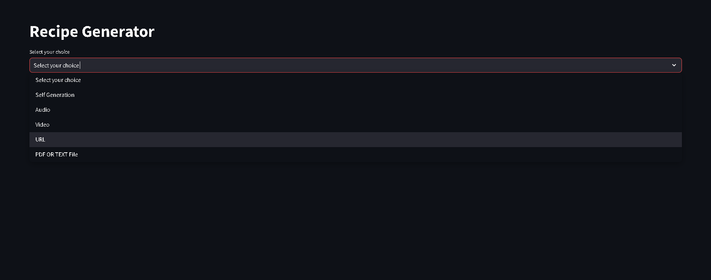

# Recipe Fusion AI



## Overview
Recipe Fusion AI is an innovative recipe generation application powered by Google's Generative AI. It allows users to generate recipes based on various input sources, including audio, video, URLs, PDFs, text files, and direct user input. The platform leverages advanced machine learning models to analyze input content and generate personalized recipes, offering a seamless user experience through a simple Streamlit interface.

## Features
- **Audio to Recipe**: Upload audio files (e.g., MP3, WAV), and the app transcribes the audio to text, then generates a recipe based on the extracted content.
- **Video to Recipe**: Upload YouTube URLs and extract transcripts to generate recipes based on the video content.
- **Text/URL to Recipe**: Extract text from uploaded URLs or PDFs/text files and generate recipes based on the content.
- **Self-Generation**: Users can input ingredients, dietary restrictions, cuisine types, and other preferences to generate personalized recipes.
- **Recipe Download**: Download generated recipes in TXT or DOCX formats.

## Installation

1. Clone this repository:
   ```bash
   git clone https://github.com/PriyanshuDey23/RecipeFusionAI.git
   cd RecipeFusionAI
   ```

2. Install the necessary dependencies:
   ```bash
   pip install -r requirements.txt
   ```

3. Set up your `.env` file with the required environment variables:
   - `GOOGLE_API_KEY`: Your Google API key for generative AI access.

```env
GOOGLE_API_KEY=your_google_api_key_here
```

## Configuration
The app uses `google.generativeai` for recipe generation and `youtube_transcript_api` for extracting YouTube video transcripts. Ensure that your environment is correctly set up:

- **Google API Key**: Add your `GOOGLE_API_KEY` in the `.env` file for the generative AI functionalities to work.

## Usage

1. **Audio Input**:
   - Upload an audio file (MP3, WAV) and click "Generate Recipe from Audio."
   - The app will transcribe the audio to text and generate a recipe based on the content.

2. **Video Input**:
   - Paste a YouTube video URL, and click "Generate Recipe."
   - The app extracts the transcript from the video and generates a recipe from the text.

3. **Self Generation**:
   - Input ingredients, dietary restrictions, cuisine type, and other preferences to create a custom recipe.
   - Click "Generate Recipe" to get the generated recipe based on your inputs.

4. **Text/URL/PDF Input**:
   - Upload a PDF or text file or provide a URL to extract text.
   - Click "Generate Recipe" to process the content and create a recipe.

## Functions

### `generate_recipe(transcript_text, prompt)`
Generates a recipe based on the given transcript text and prompt.

### `extract_transcript(youtube_video_url)`
Extracts the transcript from a YouTube video URL.

### `user_generate_recipe(...)`
Generates a recipe based on user input such as ingredients, dietary restrictions, etc.

### `save_uploaded_file(uploaded_file)`
Saves the uploaded file to a temporary directory.

### `audio_to_text(audio_file_path)`
Converts an audio file to text using Google's Generative API.

## Dependencies
- `streamlit`: Web app framework.
- `google-generativeai`: Google's Generative AI for recipe generation.
- `youtube_transcript_api`: Extracts transcripts from YouTube videos.
- `dotenv`: Loads environment variables.
- `langchain`: For chaining language models and prompts.
- `tempfile`: Manages temporary file storage.
- `requests`: For making HTTP requests (if needed for external APIs).

## Running the Application
1. Launch the app with Streamlit:
   ```bash
   streamlit run app.py
   ```
2. Access the app in your browser at `http://localhost:8501`.

## Contribution
Feel free to fork this repository, create issues, or submit pull requests if you'd like to contribute improvements to the project.

## License
This project is licensed under the MIT License.
